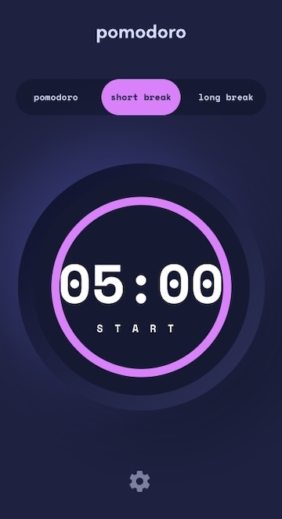
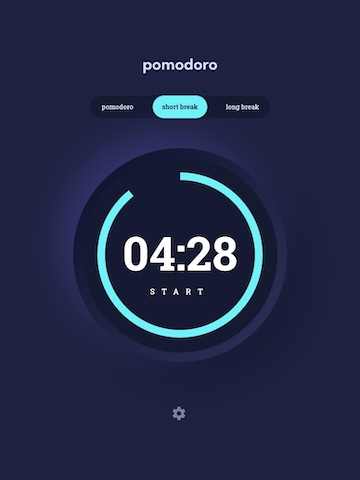

# Pomodooro App

## Table of contents

- [Overview](#overview)
  - [Features](#features)
- [Installation](#installation)
- [Screenshots](#screenshots)
- [License](#license)
- [Tech Stack](#tech-stack)
 - [Links](#links)
- [Author](#author)

## Overview

A Front End application utilizing React, Typescript, and Chakra - ui. User can customize the display to their preference as well as customize the lengths of time each timer runs for.


### Features

- Set a pomodoro timer and short & long break timers
- Customize how long each timer runs for
- See a circular progress bar that updates every minute and represents how far through their timer they are
- Customize the appearance of the app with the ability to set preferences for colors and fonts

## Installation

Clone Pomodoro from github, switch the directory to the outermost folder and run the command to install all dependencies needed for the project. 

```bash
  git clone _url_
  cd Pomodoro
  npm install
  npm run develop
```


## Screenshots





 

## License

[MIT](https://choosealicense.com/licenses/mit/)


## Tech Stack

**Client:** React, Chakra-UI, Typescript, Vite


## Links

- Solution URL: [Zacharycampanelli/Pomodoro](https://github.com/Zacharycampanelli/Pomodoro/)
- Live Site URL: [zcpomodoro.netlify.app/](https://zcpomodoro.netlify.app/)

## Author

- GitHub: [Zacharycampanelli](https://github.com/Zacharycampanelli)
- Frontend Mentor - [@Zacharycampanelli](https://www.frontendmentor.io/profile/Zacharycampanelli)
- Email: [zackjcampanelli@gmail.com](mailto:zackjcampanelli@gmail.com)
